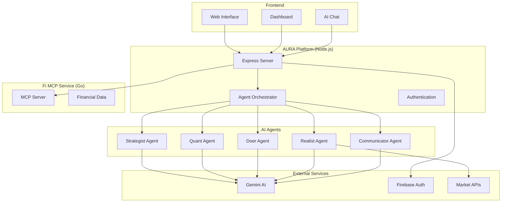

# 🚀 AURA - AI-Powered Financial Intelligence Platform

<div align="center">


**Your Personal Financial Intelligence Platform**

_Powered by Gemini 2.0 Flash & Multi-Agent AI Architecture_

[](https://aura-financial-assistant.uc.r.appspot.com)
[](https://cloud.google.com)
[](https://nodejs.org/)
[](https://golang.org/)

</div>

---

## 📋 Table of Contents

- [🎯 Overview](#-overview)
- [✨ Features](#-features)
- [🏗️ Architecture](#️-architecture)
- [🤖 AI Agents](#-ai-agents)
- [🚀 Quick Start](#-quick-start)
- [🛠️ Installation](#️-installation)
- [☁️ Deployment](#️-deployment)
- [📊 Dashboard](#-dashboard)
- [🔌 API Reference](#-api-reference)
- [🧪 Testing](#-testing)
- [📁 Project Structure](#-project-structure)
- [🔧 Configuration](#-configuration)
- [🤝 Contributing](#-contributing)
- [📄 License](#-license)

---

## 🎯 Overview

**AURA** is a cutting-edge AI-powered financial intelligence platform that combines **5 specialized AI agents** with real-time market data to provide personalized financial strategies, quantitative analysis, and actionable insights for wealth management.

### 🌟 Key Highlights

- **🤖 Multi-Agent AI**: 5 specialized financial AI agents working in orchestration
- **📊 Real-Time Data**: Live market feeds and portfolio analytics
- **🔒 Secure Integration**: Bank-grade security with Fi Money MCP
- **☁️ Cloud-Native**: Deployed on Google Cloud App Engine
- **📱 Modern UI**: Responsive design with bento grid layout
- **⚡ Real-Time Chat**: Interactive financial consultation

---

## ✨ Features

### 🎯 Core Capabilities

| Feature                 | Description                                     | Status |
| ----------------------- | ----------------------------------------------- | ------ |
| **Multi-Agent AI**      | 5 specialized agents for comprehensive analysis | ✅     |
| **Portfolio Analytics** | Real-time performance tracking & insights       | ✅     |
| **Market Intelligence** | Live NSE/BSE data integration                   | ✅     |
| **Risk Assessment**     | Advanced risk scoring & management              | ✅     |
| **Goal Planning**       | Personalized financial goal setting             | ✅     |
| **Real-Time Chat**      | Interactive AI financial consultation           | ✅     |
| **Dashboard**           | Modern, responsive portfolio dashboard          | ✅     |
| **Security**            | Bank-grade encryption & data protection         | ✅     |

### 📊 Dashboard Features

- **📈 Net Worth Tracking**: Real-time portfolio valuation
- **💳 Credit Management**: Credit score & utilization monitoring
- **🎯 Goal Setting**: Financial milestone tracking
- **📰 Market News**: Latest financial news & trends
- **⚖️ Risk Analysis**: Portfolio risk assessment
- **💰 Investment Insights**: Top performing investments
- **📋 Transaction History**: Detailed transaction analytics
- **📊 Market Overview**: Sector performance & indicators

---

## 🏗️ Architecture

AURA follows a **microservices architecture** with clear separation of concerns:



---

## 🤖 AI Agents

AURA's intelligence comes from **5 specialized AI agents** working in orchestration:

### 🎯 Strategist Agent

- **Role**: Financial Planning & Strategy
- **Capabilities**: Goal planning, risk assessment, asset allocation
- **Use Cases**: Long-term planning, investment strategies

### 🔢 Quant Agent

- **Role**: Quantitative Analysis
- **Capabilities**: XIRR/CAGR calculations, volatility analysis, risk metrics
- **Use Cases**: Performance analysis, statistical modeling

### ⚡ Doer Agent

- **Role**: Implementation & Execution
- **Capabilities**: Action plans, timeline management, platform guidance
- **Use Cases**: Converting strategies to actionable steps

### 📈 Realist Agent

- **Role**: Data Integration & Market Intelligence
- **Capabilities**: Market data fetching, real-time analysis, data validation
- **Use Cases**: Market insights, data-driven decisions

### 💬 Communicator Agent

- **Role**: User Engagement & Personalization
- **Capabilities**: Personalized communication, multi-channel engagement
- **Use Cases**: User interaction, progress updates, insights delivery

---

## 🚀 Quick Start

### Prerequisites

- **Node.js** 20+
- **Go** 1.22+
- **Google Cloud Account** with billing enabled
- **Gemini API Key** from [Google AI Studio](https://aistudio.google.com/app/apikey)

### ⚡ Local Development

```bash
# 1. Clone the repository
git clone <your-repo-url>
cd AURA

# 2. Install Node.js dependencies
cd aura-platform
npm install

# 3. Set up environment variables
cp .env.example .env
# Add your GEMINI_API_KEY to .env

# 4. Start the main platform
npm start
# Platform runs on http://localhost:3000

# 5. Start Fi MCP service (separate terminal)
cd ../fi-mcp-dev
go run main.go
# MCP service runs on http://localhost:8080
```

### 🌐 Access the Platform

- **Main App**: http://localhost:3000
- **Dashboard**: http://localhost:3000/dashboard.html
- **API Health**: http://localhost:3000/api/health

---

## 🛠️ Installation

### 📦 Dependencies

#### Node.js (Main Platform)

```json
{
	"express": "^4.18.0",
	"socket.io": "^4.7.0",
	"@google/generative-ai": "^0.1.0",
	"axios": "^1.6.0",
	"cors": "^2.8.5",
	"helmet": "^7.1.0",
	"express-rate-limit": "^7.1.0"
}
```

#### Go (Fi MCP Service)

```go
module fi-mcp-dev

go 1.22

require (
    github.com/gorilla/mux v1.8.0
    github.com/gorilla/handlers v1.5.1
)
```

### 🔧 Environment Setup

Create `.env` file in `aura-platform/`:

```env
NODE_ENV=development
PORT=3000
GEMINI_API_KEY=your-gemini-api-key-here
FIREBASE_PROJECT_ID=your-project-id
FI_MCP_URL=http://localhost:8080
```

---

## ☁️ Deployment

### 🚀 Google Cloud App Engine

AURA is optimized for Google Cloud App Engine deployment:

#### 1. Prerequisites

```bash
# Install Google Cloud CLI
brew install --cask google-cloud-sdk

# Authenticate
gcloud auth login
gcloud config set project your-project-id
```

#### 2. Automated Deployment

```python
# Use the provided deployment script
python3 deploy.py
```

#### 3. Manual Deployment

```bash
# Deploy main platform
cd aura-platform
gcloud app deploy app.yaml --quiet

# Deploy Fi MCP service
cd ../fi-mcp-dev
gcloud app deploy app.yaml --quiet

# Deploy dispatch rules
gcloud app deploy dispatch.yaml --quiet
```

#### 4. Configuration Files

**`aura-platform/app.yaml`**:

```yaml
runtime: nodejs20
service: default
env_variables:
  NODE_ENV: production
  PORT: 8080
  GEMINI_API_KEY: your-api-key
  FI_MCP_URL: https://fi-mcp-dot-your-project.uc.r.appspot.com
```

**`fi-mcp-dev/app.yaml`**:

```yaml
runtime: go122
service: fi-mcp
env_variables:
  PORT: 8080
```

**`dispatch.yaml`**:

```yaml
dispatch:
  - url: "*/fi-mcp/*"
    service: fi-mcp
  - url: "*/*"
    service: default
```

### 🌐 Live Deployment

The platform is live at: **https://aura-financial-assistant.uc.r.appspot.com**

---

## 📊 Dashboard

### 💎 Features

The AURA dashboard provides a comprehensive view of your financial portfolio:

- **🏠 Net Worth Card**: Total portfolio value with growth metrics
- **📋 Recent Transactions**: Latest financial activities
- **🎯 Financial Goals**: Progress tracking for financial milestones
- **📈 Market Review**: Current market performance and trends
- **⚖️ Risk Management**: Portfolio risk assessment with visual indicators
- **💳 Credit Overview**: Credit score and utilization metrics
- **📰 Market News**: Latest financial news and insights
- **🏆 Top Investments**: Best performing assets in your portfolio

### 🎨 Design

- **Bento Grid Layout**: Modern, card-based design
- **Responsive**: Works on desktop, tablet, and mobile
- **Real-time Updates**: Live data synchronization
- **Interactive Charts**: Dynamic visualizations using Chart.js
- **Glass Morphism**: Modern UI with subtle transparency effects

---

## 🔌 API Reference

### 🔥 Core Endpoints

#### Chat API

```http
POST /api/chat
Content-Type: application/json

{
  "message": "What should be my investment strategy?",
  "sessionId": "user-session-123"
}
```

#### Health Check

```http
GET /api/health
```

#### Fi MCP Integration

```http
POST /api/fi-mcp/net-worth
Content-Type: application/json

{
  "phoneNumber": "1234567890"
}
```

### 📊 Dashboard APIs

| Endpoint                         | Method | Description               |
| -------------------------------- | ------ | ------------------------- |
| `/api/fi-mcp/net-worth`          | POST   | Get net worth data        |
| `/api/fi-mcp/transactions`       | POST   | Fetch transaction history |
| `/api/fi-mcp/credit-report`      | POST   | Get credit report         |
| `/api/fi-mcp/mf-transactions`    | POST   | Mutual fund transactions  |
| `/api/fi-mcp/stock-transactions` | POST   | Stock transaction data    |
| `/api/fi-mcp/epf-details`        | POST   | EPF account details       |

### 🤖 Agent Response Format

```json
{
	"success": true,
	"response": "AI-generated financial advice...",
	"sessionId": "session-123",
	"agentActivity": [
		{
			"name": "Strategist",
			"icon": "🎯",
			"status": "complete",
			"activity": "Provided strategic guidance"
		}
	]
}
```

---

## 🧪 Testing

### 🔍 Health Checks

```bash
# Test main platform
curl https://aura-financial-assistant.uc.r.appspot.com/api/health

# Test AI chat
curl -X POST "https://aura-financial-assistant.uc.r.appspot.com/api/chat" \
  -H "Content-Type: application/json" \
  -d '{"message": "Hello AURA", "sessionId": "test"}'
```

### 🎯 Demo Accounts

The platform includes demo accounts for testing:

- **2222222222**: Complete portfolio with large MF holdings
- **7777777777**: Debt-heavy portfolio profile
- **8888888888**: SIP-focused investment profile

### 📊 Load Testing

```bash
# Monitor performance
gcloud app logs tail -s default
```

---

## 📁 Project Structure

```
AURA/
├── 📂 aura-platform/              # Main Node.js application
│   ├── 📂 agents/                 # AI agent implementations
│   │   ├── strategist.js          # Strategic planning agent
│   │   ├── quant.js              # Quantitative analysis agent
│   │   ├── doer.js               # Action planning agent
│   │   ├── realist.js            # Market data agent
│   │   └── communicator.js       # User communication agent
│   ├── 📂 orchestrator/          # Agent coordination
│   │   └── agent-orchestrator.js # Multi-agent orchestration
│   ├── 📂 services/              # External service integrations
│   │   └── fi-mcp-client.js      # Fi Money MCP client
│   ├── 📂 public/                # Frontend assets
│   │   ├── index.html            # Main landing page
│   │   ├── dashboard.html        # Portfolio dashboard
│   │   ├── app.js               # Chat functionality
│   │   ├── firebase-auth.js     # Authentication logic
│   │   └── styles.css           # Styling
│   ├── server.js                # Express server
│   ├── package.json             # Node.js dependencies
│   └── app.yaml                 # App Engine config
├── 📂 fi-mcp-dev/                # Go-based MCP service
│   ├── 📂 middlewares/           # HTTP middlewares
│   ├── 📂 pkg/                   # Go packages
│   ├── 📂 static/                # Static assets
│   ├── 📂 test_data_dir/         # Demo financial data
│   ├── main.go                  # Go server
│   └── app.yaml                 # App Engine config
├── 📂 deployment/                # Deployment scripts
│   ├── deploy.py                # Automated deployment
│   ├── cost_monitor.py          # Cost monitoring
│   └── README_DEPLOYMENT.md     # Deployment guide
├── dispatch.yaml                # App Engine routing
└── README.md                    # This file
```

---

## 🔧 Configuration

### 🔑 API Keys Required

| Service       | Purpose                | Get Key From                                               |
| ------------- | ---------------------- | ---------------------------------------------------------- |
| **Gemini AI** | AI agent responses     | [Google AI Studio](https://aistudio.google.com/app/apikey) |
| **Firebase**  | Authentication         | [Firebase Console](https://console.firebase.google.com)    |
| **TrueData**  | Market data (optional) | [TrueData API](https://truedata.in)                        |

### ⚙️ Environment Variables

```env
# Core Configuration
NODE_ENV=production
PORT=8080

# AI Configuration
GEMINI_API_KEY=your-gemini-api-key

# Authentication
FIREBASE_PROJECT_ID=your-project-id
FIREBASE_CLIENT_EMAIL=your-service-account-email
FIREBASE_PRIVATE_KEY=your-private-key

# Services
FI_MCP_URL=https://fi-mcp-dot-your-project.uc.r.appspot.com

# Optional Market Data
TRUEDATA_API_KEY=your-truedata-key
POLYGON_API_KEY=your-polygon-key
```

### 🔒 Security Features

- **Rate Limiting**: API endpoint protection
- **CORS**: Cross-origin request security
- **Helmet**: Security headers
- **Input Validation**: Request sanitization
- **Error Handling**: Secure error responses

---

## 🤝 Contributing

We welcome contributions to AURA! Here's how to get started:

### 🛠️ Development Setup

1. **Fork the repository**
2. **Create a feature branch**: `git checkout -b feature/amazing-feature`
3. **Make changes** and test thoroughly
4. **Commit changes**: `git commit -m 'Add amazing feature'`
5. **Push to branch**: `git push origin feature/amazing-feature`
6. **Create Pull Request**

### 📋 Contribution Guidelines

- Follow existing code style and patterns
- Add tests for new features
- Update documentation as needed
- Ensure all tests pass before submitting PR

### 🐛 Bug Reports

When reporting bugs, please include:

- Detailed description of the issue
- Steps to reproduce
- Expected vs actual behavior
- Environment details (OS, Node.js version, etc.)

---

## 📊 Performance & Monitoring

### 📈 Metrics

- **Response Time**: < 2s for AI chat responses
- **Uptime**: 99.9% availability target
- **Scalability**: Auto-scaling based on demand
- **Cost Optimization**: Efficient resource usage

### 🔍 Monitoring

```bash
# View application logs
gcloud app logs tail -s default

# Monitor costs
python3 cost_monitor.py

# Check service health
curl https://your-app.uc.r.appspot.com/api/health
```

---

## 🎯 Roadmap

### 🚀 Upcoming Features

- [ ] **Mobile App**: React Native mobile application
- [ ] **Advanced Analytics**: ML-powered insights
- [ ] **Social Features**: Investment communities
- [ ] **API Gateway**: Third-party integrations
- [ ] **White Label**: Customizable platform for partners

### 📅 Version History

- **v1.0** - Initial release with 5 AI agents
- **v1.1** - Dashboard and portfolio analytics
- **v1.2** - Google Cloud deployment
- **v1.3** - Enhanced security and performance

---

## 📄 License

This project is licensed under the **MIT License** - see the [LICENSE](LICENSE) file for details.

---

## 🙏 Acknowledgments

- **Google Cloud** for reliable infrastructure
- **Gemini AI** for powerful language models and reasoning
- **Fi Money** for financial data integration
- **Open Source Community** for amazing tools and libraries

---

<div align="center">

### 🌟 Star this project if you find it useful!

**Built with ❤️ by the AURA Team**

[](https://aura-financial-assistant.uc.r.appspot.com)

---

_Making financial intelligence accessible to everyone_ 🚀

</div>
# AURA---THE-FINANCE-AI
